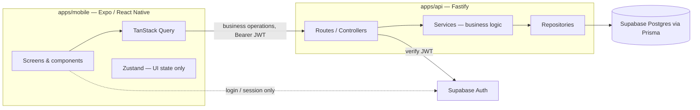

# Architecture

## High-level overview



Mobile talks to two things: the Tribute API for everything about the product (profiles, performers, organizations, events, and anything that follows), and Supabase Auth directly, but _only_ for login/session management. It never talks to the database directly, and never holds a secret more sensitive than the Supabase anon key.

## Responsibilities

- **Mobile** (`apps/mobile`) — UI, navigation, and client state. Server state (anything that comes from the API) lives in TanStack Query; Zustand is reserved for UI-only state (e.g. modal open/closed, form drafts) and must never hold data that belongs in a query cache. No business logic lives in components.
- **API** (`apps/api`) — owns all business logic, request validation (Zod), authentication, and persistence. Organized by feature module (`modules/auth`, `modules/users`, and more as they're built), each with thin routes → controllers → services (business logic) → repositories (Prisma access).
- **Database** (`packages/database`) — Supabase-hosted PostgreSQL, schema and migrations owned by Prisma. Accessed only from the API, never from mobile.

## Why Supabase Auth is separate from application business logic

Supabase Auth owns _identity_: signup, login, password reset, session/JWT issuance. It has no idea what a `PerformerProfile` or an `Organization` is — that's our domain, and it lives in our own database and API.

Keeping it this way means:

- One source of truth for domain rules (username formatting, uniqueness, future authorization logic) that Supabase Auth was never meant to enforce.
- The Supabase `service_role` key — which can bypass every safety check in the database — only ever exists on the API's server, never on a phone.
- We can evolve or even swap the auth provider later without rewriting business logic, since the API only depends on "a verified user id + email," not on Supabase-specific auth internals.

## Authentication flow

1. Mobile signs in via the Supabase Auth SDK (email/password, OAuth, etc.) using the public `SUPABASE_ANON_KEY`. The API is not involved in login itself.
2. Supabase issues a JWT access token, signed with the project's shared JWT secret.
3. Mobile calls Tribute API endpoints with `Authorization: Bearer <token>`.
4. The API's auth plugin (`apps/api/src/modules/auth/auth.plugin.ts`) verifies the token **locally**, using `jose` and `SUPABASE_JWT_SECRET` (HS256, algorithm explicitly pinned). No network call to Supabase happens on the request path.
5. Verified claims (`sub`, `email`) populate `request.user`, available to any route behind the `authenticate` preHandler via `requireUser(request)`.
6. `POST /api/v1/users/me` uses `request.user.id` to find-or-create a matching `UserProfile` row. This is the sync point between a Supabase Auth identity and our domain database — `UserProfile.id` is always exactly `auth.users.id`, never independently generated.

**Local vs. remote verification, and why local won:** verifying the JWT signature locally is fast (no per-request network hop) and doesn't couple every authenticated API call to Supabase Auth's uptime — only login does. The tradeoff is real-time revocation: if a user is banned, their existing token stays valid until it naturally expires (Supabase's default token lifetime is short, ~1 hour), rather than failing instantly. That's an accepted tradeoff for now, not an oversight — worth revisiting if/when instant revocation becomes an actual product requirement (e.g. trust & safety tooling).

**Authorization is explicitly out of scope** for this phase — `request.user` tells you _who_ is calling, not what they're allowed to do. Role/permission checks (e.g. "only an organization admin can edit this event") are future work.

## Database architecture

Supabase-hosted PostgreSQL, schema owned entirely by Prisma migrations in `packages/database/prisma/`. Two separate connection strings are used, which is Supabase-specific and easy to get wrong:

- `DATABASE_URL` — the **pooled** connection (Supavisor/PgBouncer, transaction mode, port 6543). Used by the running API for normal queries; pooling handles many short-lived connections well, which matters for serverless-style scaling later.
- `DIRECT_URL` — the **direct** connection (port 5432). Used only by `prisma migrate`, because Supabase's transaction-mode pooler doesn't support the prepared statements Prisma Migrate needs.

### Current schema (Phase 2)

| Model                 | Purpose                                                                                                                                        |
| --------------------- | ---------------------------------------------------------------------------------------------------------------------------------------------- |
| `UserProfile`         | Mirrors a Supabase Auth user; `id` matches `auth.users.id` exactly.                                                                            |
| `PerformerProfile`    | Optional 1:1 extension of a user who performs. `performerType` is a plain string (not an enum) so the app can generalize beyond dancers later. |
| `DanceStyle`          | Reference data (seeded), unique `slug`.                                                                                                        |
| `PerformerDanceStyle` | Many-to-many join, composite PK, `isPrimary` flag.                                                                                             |
| `Organization`        | Powwow orgs; unique `slug`; `createdBy` uses `onDelete: Restrict` so a user can't be deleted while still owning an org.                        |
| `OrganizationMember`  | Composite-PK membership with a `role` enum (`OWNER`/`ADMIN`/`MEMBER`).                                                                         |
| `Event`               | Belongs to an org; `slug` is unique **per organization**, not globally.                                                                        |
| `EventAttendance`     | Composite-PK; `attendanceType` enum (`ATTENDING`/`COMPETING`).                                                                                 |

All foreign keys, cascade behavior, and indexes are defined explicitly in `schema.prisma` — nothing is left to Postgres/Prisma defaults without a deliberate choice. No feature-level API routes exist yet for `Organization`/`Event`/etc. — only the schema. That's intentional: Phase 2 is the data foundation, Phase 3 builds the feature modules on top of it.

## The `packages/database` package

- `prisma/schema.prisma` + `prisma/migrations/` — the single source of truth for the schema, versioned as SQL migrations.
- `src/client.ts` — a singleton `PrismaClient`, guarded against connection-leak duplication when `tsx watch` hot-reloads the API in development.
- `src/index.ts` — re-exports `prisma` plus every generated Prisma type/enum, so other packages import everything from `@tribute/database`.
- Consumed as raw TypeScript source by other workspace packages (no build step) — the same pattern used by `@tribute/types`/`@tribute/validation`/`@tribute/config`. This is a deliberate simplicity choice for packages that are never published and always run through `tsx`/Metro; revisit if a standalone compiled artifact is ever needed (e.g. a slim container image).

## Migration strategy

- All schema changes go through `prisma migrate dev`, which generates a timestamped SQL file under `prisma/migrations/` and applies it — the migration history is the audit trail, never hand-edited.
- Migrations are additive by default at this stage (no models have been removed or restructured yet).
- **Any destructive change (dropping a column/table, tightening a nullable column, renaming in a way Prisma can't detect automatically) will be explained before it's run** — this is a standing project rule, not just for this phase.
- `db:reset` drops and recreates the database from the full migration history and reseeds it. It is destructive and dev-only — never run against an environment with real user data without explicit confirmation first.
- `db:push` (schema sync without a migration file) is available for rapid local prototyping but isn't part of the normal workflow — real schema changes should go through `db:migrate` so there's a committed history.

## Error handling

Every error response has the same shape:

```json
{ "error": { "code": "SOME_CODE", "message": "Human-readable message" } }
```

`AppError` subclasses (`AuthenticationError` → 401, `ConflictError` → 409, `NotFoundError` → 404) map directly to their status code. Unmapped `ZodError`s become `400 VALIDATION_ERROR` with per-field details. Unmapped Prisma errors get sane defaults (unique violation → 409, record not found → 404, foreign key violation → 400, connection failure → 503). Anything else becomes a generic `500` — the real error is logged server-side but never leaked to the client.

## Logging

Fastify's built-in Pino logger: pretty-printed and colorized in `development`, structured JSON in `production` (for log aggregation). `Authorization` and `Cookie` headers are explicitly redacted in the logger config as defense-in-depth, on top of Fastify's default request serializer already not logging headers/body by default. Startup logs the outcome of the database connection attempt before the server starts accepting requests — the process fails fast and exits if the database is unreachable, rather than starting in a broken state.

## Where future integrations will plug in

None of these exist yet — noted here so future work has an obvious landing spot:

- **Cloudflare R2** (photos/posters) — API-mediated signed upload URLs, likely behind a small `packages/storage` abstraction. Mobile never holds an R2 credential directly.
- **Cloudflare Stream** (video/livestreaming) — same signed-URL-via-API pattern as R2.
- **Stripe Connect** (financial support for dancers) — entirely API-mediated; Stripe secret keys never reach the client. Will need its own `modules/payments`, and almost certainly webhook handling.
- **Expo Notifications** (push) — the API will own device token storage and trigger sends server-side.
- **PostHog / Sentry** (analytics/monitoring) — lower-risk to add incrementally to both mobile and API since they use public-safe client keys, but neither is wired in yet.
